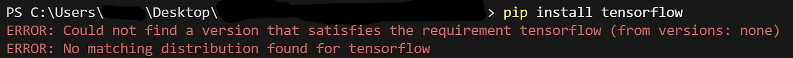
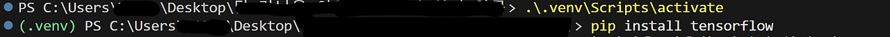
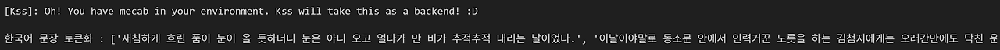
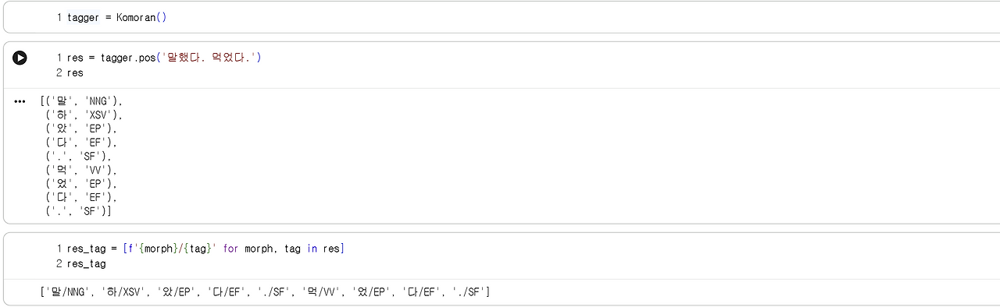

*과거 티스토리에 작성했던 글을 수정 후 옮겨왔습니다*  
자연어 처리 공부 내용 정리  
교재는 위키독스에 있는 ['딥러닝을 이용한 자연어 처리 입문'](https://wikidocs.net/book/2155)을 이용했다.  
  
## 환경설정
Python을 이용하는데 TensorFlow 버전이 맞지 않아 애를 좀 먹었다... 지금까지는 자료구조나 알고리즘 위주로 공부했어서 TensorFlow를 사용할 일이 없었는데, 알고 보니 최신 파이썬 버전과 호환되지 않은지 꽤 되었다고 한다.  
  
_최신 파이썬에서 TensorFlow 설치 시 발생한 오류_  

파이썬 3.11 버전을 다시 깔고 가상 환경을 만들어 주었다.  

```powershell
py -3.11 -m venv .venv
.\.venv\Scripts\activate
```  

  
정상적으로 활성화가 되면 위처럼 (.venv)가 앞에 붙게 된다.  
가상환경에서는 기존에 쓰던 모듈들을 다시 받아줘야 합니다. TensorFlow 말고도 numpy, pandas 등 필요한 모듈들을 다시 설치했다. 교재에서 ipynb 파일을 사용하길래 jupyter ipykernel도 다시 받아주었다. 커널은 자동으로 가상환경 거를 받아오던데, 안되면 우측 상단의 커널을 바꿔주면 된다.  

## 텍스트 전처리란?
우리가 사용하는 텍스트는 비정형 데이터이기 때문에 바로 이걸 분석하기가 굉장히 까다롭다. 그래서 텍스트를 적절히 분석하기 좋은 형태로 쪼개주어야 하는데 이 과정을 텍스트 전처리라고 부른다.  
### 1 토큰화(Tokenization)
코퍼스 데이터는 토큰화, 정제, 정규화 과정을 거쳐 사용하게 되는데, 그 중 코퍼스를 토큰이라는 큰 덩어리로 나누는 것을 토큰화라고 부른다. 토큰을 어떻게 잡는지에 따라 토큰화의 종류가 나뇐다.  
#### 1.1 단어 토큰화
토큰의 기준을 단어로 하는 경우를 단어 토큰화라고 부른다. nltk와 TensorFlow에서는 단어 토큰화를 위해 다양한 도구를 제공한다.  

```python
import nltk
from nltk.tokenize import word_tokenize
from nltk.tokenize import WordPunctTokenizer
from tensorflow.keras.preprocessing.text import text_to_word_sequence # pyright: ignore[reportMissingImports]

nltk.download('punkt_tab')
```
교재에서는 총 3개의 도구를 사용했는데, nltk에서 제공하는 word_tokenize와 WordPunckTokenizer, 그리고 TensorFlow에서 제공하는 text_to_word_sequence를 사용했다.  

**nltk.download()**를 사용하면 20분이 넘어도 다 다운로드가 안되길래 그냥 punkt_tab을 따로 다운로드했다. 교재에 punkt를 사용하게 나와있는데, 2024년 말쯤에 punkt가 사용하는 Pickle의 보안 관련 문제 때문에 punkt_tab을 사용하기 시작했다고 한다. punkt만 받으면 LookupError가 떠서 punkt_tab을 사용했다. 아마 파이썬이 punkt_tab을 우선적으로 사용하려는 거 같다.  

**Input**  
```python
print('단어 토큰화1 :',word_tokenize("Don't be fooled by the dark sounding name, Mr. Jone's Orphanage is as cheery as cheery goes for a pastry shop."))
print('단어 토큰화2 :',WordPunctTokenizer().tokenize("Don't be fooled by the dark sounding name, Mr. Jone's Orphanage is as cheery as cheery goes for a pastry shop."))
print('단어 토큰화3 :',text_to_word_sequence("Don't be fooled by the dark sounding name, Mr. Jone's Orphanage is as cheery as cheery goes for a pastry shop."))
```  

**Output**
```plaintext
단어 토큰화1 : ['Do', "n't", 'be', 'fooled', 'by', 'the', 'dark', 'sounding', 'name', ',', 'Mr.', 'Jone', "'s", 'Orphanage', 'is', 'as', 'cheery', 'as', 'cheery', 'goes', 'for', 'a', 'pastry', 'shop', '.']
단어 토큰화2 : ['Don', "'", 't', 'be', 'fooled', 'by', 'the', 'dark', 'sounding', 'name', ',', 'Mr', '.', 'Jone', "'", 's', 'Orphanage', 'is', 'as', 'cheery', 'as', 'cheery', 'goes', 'for', 'a', 'pastry', 'shop', '.']
단어 토큰화3 : ["don't", 'be', 'fooled', 'by', 'the', 'dark', 'sounding', 'name', 'mr', "jone's", 'orphanage', 'is', 'as', 'cheery', 'as', 'cheery', 'goes', 'for', 'a', 'pastry', 'shop']
```
각각에서 발견할 수 있는 특징은 다음과 같다.  
| 구분 | word_tokenize | WordPunctTokenizer | text_to_word_sequence |
| --- | --- | --- | --- |
| marking of omission | "Do" + "n't" | "Don" + "'" + "t" | "Don't" |
| marking of possessive case | "Jone" + "'s" | "Jone" + "'" + "s" | "Jone's" |
| punctuation | 포함 | 포함 | 제거(아포스트로피 제외) |
| upper letter | 유지 | 유지 | 소문자로 치환 |

#### 1.2 토큰화에서 고려해야 할 사항
문장부호를 함부로 삭제해서는 안된다. 마침표는 문장을 구분해주는 중요한 표지이며, 단어 내에서 사용되는 경우도 심심찮게 있다. 또, 소수점을 표기하느라 사용되는 경우도 있다. 쉼표는 숫자 등에서도 사용되기 때문에 임의로 없애거나 (예사말로) 퉁쳐서 처리하게 되면 여러 가지 문제가 발생할 수 있다. 또한, 띄어쓰기가 포함되어 있지만 한 단어인 경우 등도 고려해야 할 사항이다. 아포스트로피와 함께 쓰인 clitic의 형태 역시 분석에 있어서 잘 살펴보아야 한다.  
  
표준 토큰화 도구인 Penn Treebank Tokenization을 이용하면 하이픈(-)으로 이어진 단어들은 하나로 취급해 주고, clitic은 분리해 주는 모습을 확인할 수 있다.  

**Input**
```python
from nltk.tokenize import TreebankWordTokenizer

tokenizer = TreebankWordTokenizer()

text = "Starting a home-based restaurant may be an ideal. it doesn't have a food chain or restaurant of their own."

print('TreebankWordTokenizer: ', tokenizer.tokenize(text))
```  

**Output**
```plaintext
TreebankWordTokenizer:  ['Starting', 'a', 'home-based', 'restaurant', 'may', 'be', 'an', 'ideal.', 'it', 'does', "n't", 'have', 'a', 'food', 'chain', 'or', 'restaurant', 'of', 'their', 'own', '.']
```

#### 1.3 문장 토큰화
사용하고자 하는 토큰의 단위가 문장이면 문장 토큰화이다. 앞서 얘기했던 것처럼 마침표는 문장을 구분해주기도 하지만 단어 내에 마침표가 사용되는 경우도 있는데, 그렇기 때문에 단순히 마침표를 문장 구분 표지로 쓰기에는 쉽지 않다.  
  
다행스럽게도 nltk에서는 sent_tokenize를 지원하고 있고, 이를 통해 쉽게 영어 문장의 토큰화를 진행할 수 있다.  

**Input**
```python
from nltk.tokenize import sent_tokenize

text1 = "His barber kept his word. But keeping such a huge secret to himself was driving him crazy. Finally, the barber went up a mountain and almost to the edge of a cliff. He dug a hole in the midst of some reeds. He looked about, to make sure no one was near."
print('문장 토큰화1: ', sent_tokenize(text1))

text2 = "I am actively looking for Ph.D. students. and you are a Ph.D student."
print('문장 토큰화2: ', sent_tokenize(text2))
```  

**Output**
```plaintext
문장 토큰화1:  ['His barber kept his word.', 'But keeping such a huge secret to himself was driving him crazy.', 'Finally, the barber went up a mountain and almost to the edge of a cliff.', 'He dug a hole in the midst of some reeds.', 'He looked about, to make sure no one was near.']
문장 토큰화2:  ['I am actively looking for Ph.D. students.', 'and you are a Ph.D student.']
```  

단어 내에 마침표가 있더라도(Ph.D.) 정상적으로 문장 단위로 쪼개지는 걸 확인할 수 있다.  

한국어 문장의 경우에는 kss 모듈을 받아 사용하면 된다.  
```python
import kss

text = "새침하게 흐린 품이 눈이 올 듯하더니 눈은 아니 오고 얼다가 만 비가 추적추적 내리는 날이었다.이날이야말로 동소문 안에서 인력거꾼 노릇을 하는 김첨지에게는 오래간만에도 닥친 운수 좋은 날이었다. 문안에(거기도 문밖은 아니지만) 들어간답시는 앞집 마마님을 전찻길까지 모셔다 드린 것을 비롯으로 행여나 손님이있을까 하고 정류장에서 어정어정하며 내리는 사람 하나하나에게 거의 비는듯한 눈결을 보내고 있다가 마침내 교원인 듯한 양복쟁이를 동광학교(東光學校)까지 태워다 주기로 되었다.첫 번에 삼십전 , 둘째 번에 오십전 - 아침 댓바람에 그리 흉치 않은 일이었다. 그야말로 재수가 옴붙어서 근 열흘 동안 돈 구경도 못한 김첨지는 십전짜리 백동화 서 푼, 또는 다섯 푼이 찰깍 하고 손바닥에 떨어질 제 거의눈물을 흘릴 만큼 기뻤었다. 더구나 이날 이때에 이 팔십 전이라는 돈이 그에게 얼마나 유용한지 몰랐다. 컬컬한 목에 모주 한 잔도 적실 수 있거니와그보다도 앓는 아내에게 설렁탕 한 그릇도 사다 줄 수 있음이다."
print('한국어 문장 토큰화 :',kss.split_sentences(text))
```  

Windows에서 Mecab 설치 하는 게 번거로워서 [현종환](https://pypi.org/project/python-mecab-ko/)님이 만들어주신 패키지를 사용하였다.

```powershell
pip install python-mecab-ko
```  
  

#### 1.4 한국어에서의 토큰화의 어려움
한국어에서는 단어 토큰화가 큰 의미가 없다. 일반적으로 단어 토큰화라고 함은 어절 단위로 나누는 것인데 한국어는 조사 등으로 인해 한 어절 안에 여러 개의 단어가 들어있는 경우가 허다하기 때문이다. 언어학이 주전공이고, 4년 전에 한국어 코퍼스를 다루는 전공 수업을 수강한 적이 있기 때문에 간단하게 넘어가보겠다.  
  

#### 1.5 POS Tagging
단어 토큰화가 큰 의미가 없는 한국어에서는 더더욱 POS Tagging의 과정이 중요한데, 원시 코퍼스에 POS Tagging과 같은 과정을 거쳐 주석을 달아놓은 걸 주석 코퍼스라고 부르기도 한다. 위에 수업 수강 당시 POS Tagging을 했던 걸 확인할 수 있다. 주석 코퍼스는 Parsed Tagging을 해서도 만들 수 있는데, 교재에서는 Okt와 Kommoran을 사용하고 있으니 실습을 한 번 해보았다. 형태소 분석기의 종류에 따라 POS Tagging은 다양하게 이루어질 수 있다.  
  
**Input**  
```python
from konlpy.tag import Okt
from konlpy.tag import Kkma
from mecab import MeCab

okt = Okt()
kkma = Kkma()
mecab = MeCab()

print('OKT 형태소 분석:',okt.morphs("열심히 코딩한 당신, 연휴에는 여행을 가봐요"))
print('OKT 품사 태깅:',okt.pos("열심히 코딩한 당신, 연휴에는 여행을 가봐요"))
print('OKT 명사 추출:',okt.nouns("열심히 코딩한 당신, 연휴에는 여행을 가봐요")) 
print('-'*40)
print('꼬꼬마 형태소 분석:',kkma.morphs("열심히 코딩한 당신, 연휴에는 여행을 가봐요"))
print('꼬꼬마 품사 태깅:',kkma.pos("열심히 코딩한 당신, 연휴에는 여행을 가봐요"))
print('꼬꼬마 명사 추출:',kkma.nouns("열심히 코딩한 당신, 연휴에는 여행을 가봐요"))
print('-'*40)
print('메캅 형태소 분석 :',mecab.morphs("열심히 코딩한 당신, 연휴에는 여행을 가봐요"))
print('메캅 품사 태깅 :',mecab.pos("열심히 코딩한 당신, 연휴에는 여행을 가봐요"))
print('메캅 명사 추출 :',mecab.nouns("열심히 코딩한 당신, 연휴에는 여행을 가봐요"))
```  
**Output**  
```plaintext
OKT 형태소 분석: ['열심히', '코딩', '한', '당신', ',', '연휴', '에는', '여행', '을', '가봐요']
OKT 품사 태깅: [('열심히', 'Adverb'), ('코딩', 'Noun'), ('한', 'Josa'), ('당신', 'Noun'), (',', 'Punctuation'), ('연휴', 'Noun'), ('에는', 'Josa'), ('여행', 'Noun'), ('을', 'Josa'), ('가봐요', 'Verb')]
OKT 명사 추출: ['코딩', '당신', '연휴', '여행']
----------------------------------------
꼬꼬마 형태소 분석: ['열심히', '코딩', '하', 'ㄴ', '당신', ',', '연휴', '에', '는', '여행', '을', '가보', '아요']
꼬꼬마 품사 태깅: [('열심히', 'MAG'), ('코딩', 'NNG'), ('하', 'XSV'), ('ㄴ', 'ETD'), ('당신', 'NP'), (',', 'SP'), ('연휴', 'NNG'), ('에', 'JKM'), ('는', 'JX'), ('여행', 'NNG'), ('을', 'JKO'), ('가보', 'VV'), ('아요', 'EFN')]
꼬꼬마 명사 추출: ['코딩', '당신', '연휴', '여행']
----------------------------------------
메캅 형태소 분석 : ['열심히', '코딩', '한', '당신', ',', '연휴', '에', '는', '여행', '을', '가', '봐요']
메캅 품사 태깅 : [('열심히', 'MAG'), ('코딩', 'NNG'), ('한', 'XSA+ETM'), ('당신', 'NP'), (',', 'SC'), ('연휴', 'NNG'), ('에', 'JKB'), ('는', 'JX'), ('여행', 'NNG'), ('을', 'JKO'), ('가', 'VV'), ('봐요', 'EC+VX+EC')]
메캅 명사 추출 : ['코딩', '당신', '연휴', '여행']
```